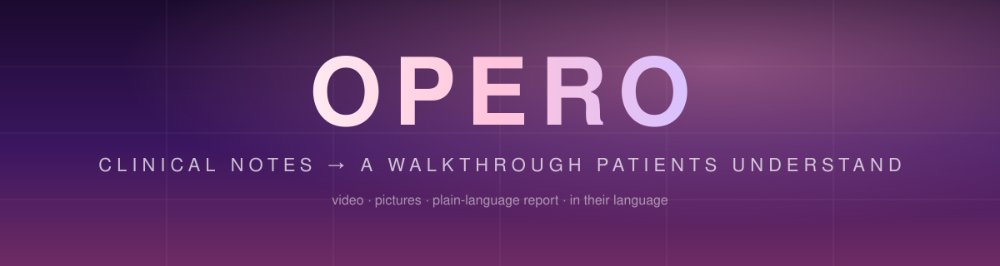

<div align="center">



# Opero

**Turning clinical notes into care patients actually understand.**

A doctor writes their notes the way they always do. Opero turns them into a narrated 3D walkthrough,
step-by-step pictures, and a plain-language report — in the patient's own language — sent to their phone in one click.


[Live Demo →](https://opero-ochre.vercel.app) &nbsp;|&nbsp; [How It Works](#how-it-works) &nbsp;|&nbsp; [Getting Started](#getting-started) &nbsp;|&nbsp; [Safety](#safety-by-design)

</div>

---

## About The Project

The night before surgery is when fear peaks. Patients get a consent form written for lawyers, a rushed
explanation, and a night of searching the internet for pictures they should never see.

Opero sits between the doctor's keyboard and the patient's phone. The doctor keeps writing shorthand —
`Pt 46F, symptomatic cholelithiasis, elective lap chole under GA, NPO after midnight, RTC if fever >38.5C` —
and the patient receives:

- **What's happening in their body** — the diagnosis in everyday words, never blaming, never frightening
- **Why this plan** — the reasons the doctor actually wrote, plus any other options they mentioned
- **A narrated video** — calm 3D scenes, step by step, with subtitles and a warm voice
- **Pictures** — one gentle illustration per step, safe to look at
- **A report** — printable, shareable, with the medical words explained
- **Answers, any time** — a chatbot that replies only from the doctor's notes, and says so when something isn't covered

Everything comes from the notes. Nothing is invented — not a reason, not a timeframe, not a risk.

## How It Works

```
Doctor's notes
      │
      ▼
Gemini · strict medical + visual rules ──▶ plain-language plan (3 depths of detail, any language)
      │
      ▼
Safety filter · rewrites graphic wording, leaves warning signs plain
      │
      ├──▶ Video      narrated 3D scenes with subtitles
      ├──▶ Images     one illustration per step, from the same safe scenes
      └──▶ Report     printable, plain-language document
                          │
                          ▼
            One WhatsApp or SMS link to the patient
```

**Anxiety Control** — every step is written at three depths. The doctor picks a starting level;
the patient can switch any time between *Just the basics*, *A bit more*, and *Full picture*.

## Safety By Design

Explaining surgery to a frightened person is not a place for AI improvisation.

| Guard | What it does |
| --- | --- |
| **Fixed scene library** | The AI never draws. It can only pick from pre-built 3D scenes (sleep, inflate, camera, close, home…). Blood, cuts and needles don't exist in that library, so they cannot appear. |
| **Two language layers** | Strict rules in the model prompt, then a deterministic filter that rewrites anything graphic that slips through. |
| **Warning signs stay plain** | "Call your doctor if…" is never softened — a patient must know when to get help. |
| **Grounded answers** | The Q&A uses only the doctor's notes. Not covered? It says so and points to the care team. Emergencies are escalated immediately. |
| **No invented facts** | No reasons, statistics or timeframes the doctor didn't write. |

## Built With

| Layer | Choice |
| --- | --- |
| Framework | Next.js 16 (App Router), React 19, TypeScript |
| UI | Tailwind v4, shadcn/ui, Motion |
| 3D | react-three-fiber + three.js, rendered in the browser |
| AI | Gemini — rewriting, grounded Q&A, and the narration voice |
| Data | MongoDB Atlas — accounts, walkthroughs, cached narration |
| Delivery | WhatsApp click-to-chat, or Twilio SMS |
| Hosting | Vercel |

## Getting Started

```bash
git clone https://github.com/Arishsingh/Opero.git
cd Opero
npm install
cp .env.example .env.local     # add the keys below
npm run dev                    # http://localhost:3000
```

### Environment

| Variable | Needed for |
| --- | --- |
| `MONGODB_URI` `MONGODB_DB` `MONGODB_COLLECTION` | accounts, walkthroughs, cached narration |
| `GEMINI_API_KEY` | rewriting the notes, the Q&A, the narration voice |
| `NEXT_PUBLIC_APP_URL` | the address used in links sent to patients |
| `SESSION_SECRET` | signs the sign-in cookie |
| `ELEVENLABS_API_KEY` | optional — replaces the Gemini narration voice |
| `TWILIO_ACCOUNT_SID` `TWILIO_AUTH_TOKEN` `TWILIO_FROM_NUMBER` | optional — sends SMS from the server |

Without a Gemini key the app falls back to a built-in sample walkthrough, so a demo never depends on the venue Wi-Fi.

### Try It

1. Sign up with an email, and the dashboard opens.
2. Paste procedure notes (or press the document icon for a sample) and set the patient's name, language and detail level.
3. Watch the video, open the pictures and the report on the right.
4. Ask a question the way a patient would — "When can I shower?", "Can I drink wine?"
5. Press **Send to patient**, enter a number, and WhatsApp opens with the message ready.

## Project Layout

```
src/app          landing, sign-up, dashboard, patient page (/p), report (/r), API routes
src/components   dashboard, 3D scene library, video player, image gallery, report
src/lib          Gemini prompts, safety filter, storage, sessions, voice
tests            unit tests for the safety filter, grounded answers, API validation
```

## Tests

```bash
npm test           # unit tests
npx tsc --noEmit   # types
npm run lint
```

## Roadmap

- Photo-real illustrations and video (Imagen / Veo) — needs a billed Gemini key
- A choice of patient avatars, rather than one
- Attaching the report PDF and pictures directly in WhatsApp
- Section headings translated along with the content

---

<div align="center">

**Opero explains care in everyday words, based on what the doctor wrote.**
It does not give medical advice, and never says anything the notes don't.

</div>
